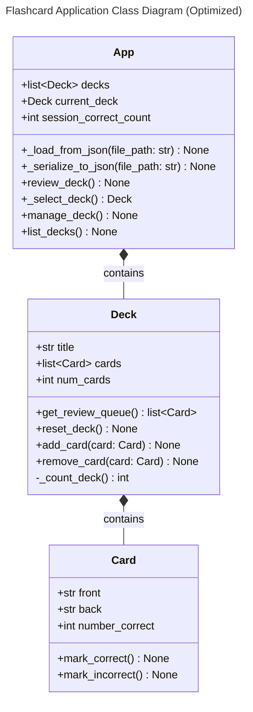
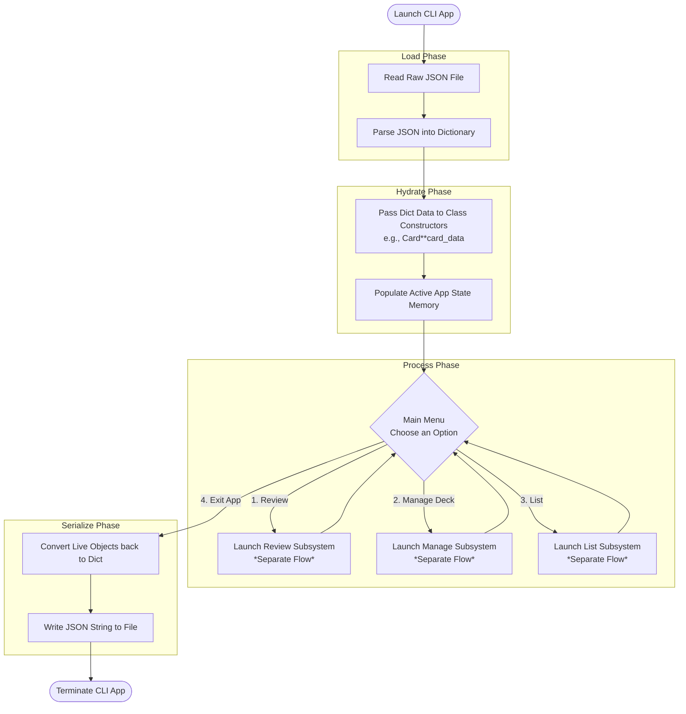
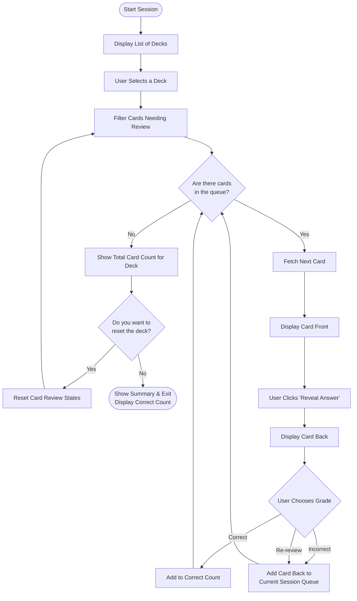
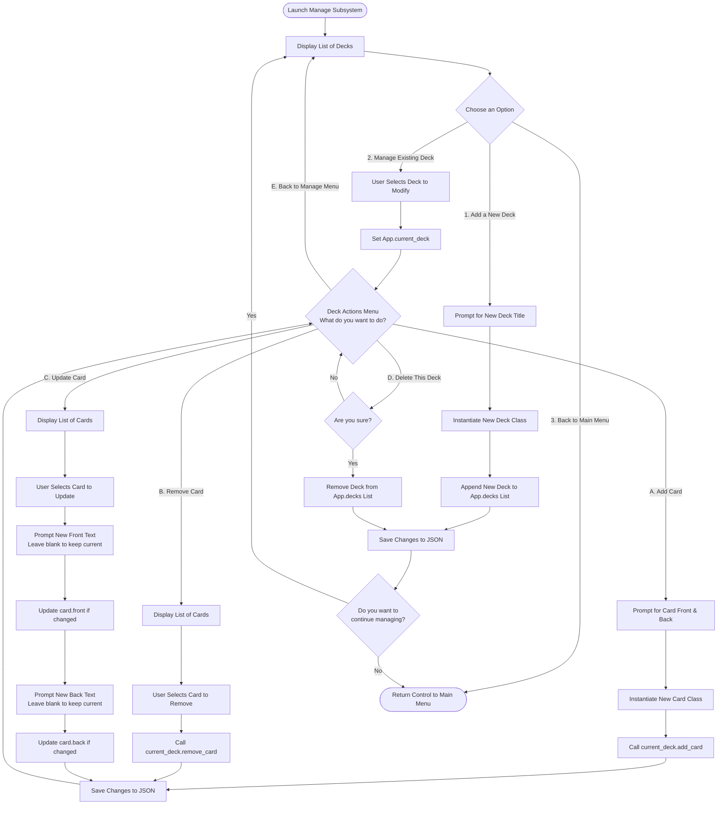
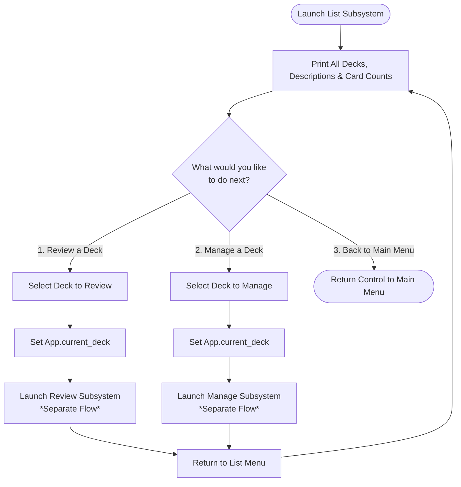

# High-Level Architecture and Structure

Prog-Flash is a command-line flashcard application built with Python, designed for efficient spaced repetition and knowledge review directly in the terminal. The architecture separates core data logic from the user interface (CLI).

**Core Components:**
*   **Data Layer:** Manages the creation, loading, and saving of structured card decks (flashcards) typically persisted as JSON files. This layer handles the serialization/deserialization of content for subjects and individual cards.
*   **State Management (`StudySessionController`):** This component is responsible for managing the current state of a learning session—tracking which deck is active, the progression through cards, and controlling the flow (e.g., deciding if the user should see the front or back).
*   **Presentation Layer (`Card`):** Encapsulates the view logic for a single flashcard, handling how the question and answer are displayed to the CLI user.
*   **Application Entry Point:** The main executable point that initializes dependencies and routes commands (e.g., `prog-flash review`, `prog-flash create`).

## Class Diagram

## App Startup

## Review Flow

## Manage Deck Flow

## List Flow

